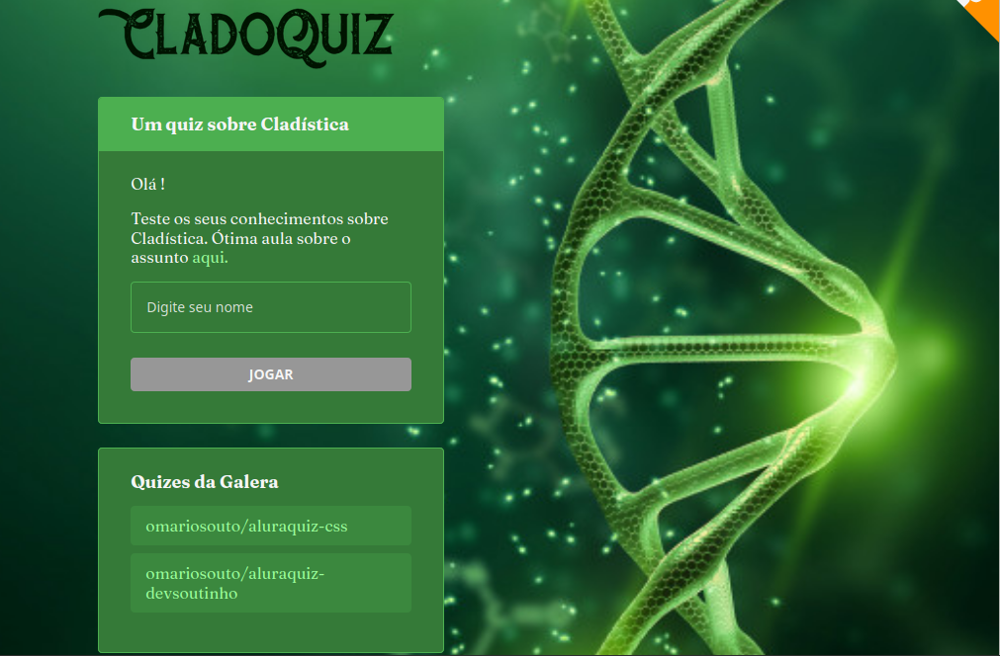

<h1 align="center">

</h1>
<h1 align="center">

</h1>

<h3 align="center">
    <a href="https://cladoquiz.carol42.vercel.app/">Acessar a demonstração</a>
</h3>
<h3 align="center">
    <a href="https://diver-study-ewkrfsz1p.vercel.app/">Acessar meu projeto feito na Imersão React 1ª edição</a>
</h3>
<h3 align="center">
    <a href="https://disnil.vercel.app/">Acessar meu segundo projeto inspirado na Imersão React 1ª edição</a>
</h3>

##  Sobre
Esse projeto consiste em um quiz sobre Cladística: a ferramenta mais utilizada pelos cientistas para analisar as relações de parentesco entre os seres vivos.

Foi desenvolvido durante a #ImersãoReact 2ª edição da #Alura

---

## Tecnologias utilizadas

- [React.js](https://reactjs.org/)
- [Next.js](https://nextjs.org/)

---

## Como baixar o projeto

```bash
# Clonar o repositório
$ git clone https://github.com/Carol42/cladoquiz

# Entrar no diretório
$ cd cladoquiz

# Instalar as dependências
$ npm install

# Iniciar o projeto
$ npm run dev
```

Desenvolvido por Caroline H Oliveira